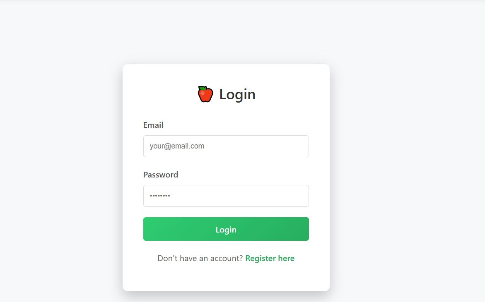
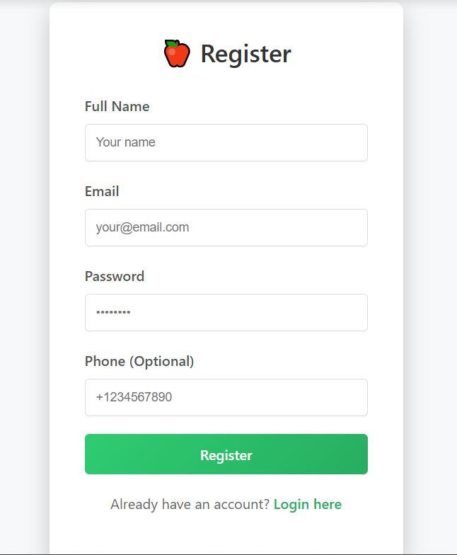
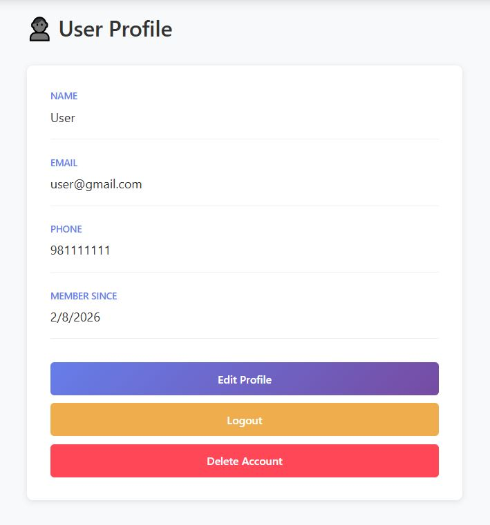

# 🌱 Smart Food Waste Reduction System

A comprehensive full-stack web application designed to track food inventory, monitor expiry dates, reduce food waste, and provide actionable insights. The system helps users and organizations manage food efficiently through real-time tracking, alerts, and analytics.

---

## ✨ Key Features

### **Core Functionality**
- ✅ **JWT Authentication** - Secure user registration and login with protected routes
- ✅ **User Profile Management** - View and update profile, manage account
- ✅ **Food Inventory Management** - Add, view, and manage food items with details
- ✅ **Expiry Date Tracking** - Automatic expiry state calculation (FRESH, NEAR_EXPIRY, EXPIRED)
- ✅ **Smart Alerts** - Real-time notifications for items nearing expiry
- ✅ **Status Management** - Track food lifecycle: AVAILABLE → USED/DONATED/WASTED
- ✅ **Donation Centers** - Create and manage local donation centers
- ✅ **Donation Offers** - Create food donation offers with multiple items
- ✅ **Automatic Logging** - Every status change is logged automatically
- ✅ **Waste Analytics** - Comprehensive insights on food waste patterns by user
- ✅ **Search & Filter** - Find items by name, category, or status
- ✅ **Responsive Design** - Works seamlessly on desktop and mobile devices

### **Pages**
- **Login/Register** - Secure authentication with JWT tokens
- **Dashboard** - Real-time statistics and alert banner
- **Add Item** - User-friendly form with category dropdown
- **Inventory** - Searchable table with action buttons and status updates
- **Alerts** - Urgent items sorted by expiry urgency
- **Donation Centers** - Manage donation center locations
- **Donation Offers** - Create and track food donations
- **Analytics** - Waste breakdown by category/reason with recommendations
- **Profile** - View and edit user account details

---

## 📸 Screenshots

### Login - Secure Authentication

*JWT-based authentication with clean, minimal design*

### Register - User Registration

*Create new account with name, email, password, and phone*

### Dashboard - Real-time Statistics & Alerts

*View real-time stats, alert banner, quick links, and usage summary*

### Add Item - Food Entry Form

*Easy-to-use form with category dropdown, units, and storage location*

### Inventory - Search & Manage Items

*Searchable table with filters, color-coded badges, and status update buttons*

### Alerts - Urgent Items

*Items needing attention with urgency badges and quick actions*

### Donation Centers - Manage Centers

*Create and manage local donation centers with contact details*

### Donation Offers - Track Donations

*Create multi-item donation offers and track status updates*

### Analytics - Waste Insights

*Comprehensive breakdown by category, reason, and actionable recommendations*

### User Profile - Account Management

*View and edit user profile, manage account settings*

---

## 🛠️ Tech Stack

### **Backend**
- **Framework**: Flask with Flask-CORS
- **ORM**: SQLAlchemy
- **Database**: SQLite (default for development)
- **Language**: Python 3.8+
- **Key Libraries**: Flask-JWT-Extended, Werkzeug, python-dotenv

### **Frontend**
- **Framework**: React 18 with Vite
- **Routing**: React Router v7
- **HTTP Client**: Axios
- **Key Libraries**: Protected routes, JWT authentication, responsive design

**Directory Structure**:
```
frontend/
├── public/                           # Static assets
├── src/
│   ├── App.jsx                       # Main app component with routing
│   ├── main.jsx                      # Entry point
│   ├── components/
│   │   ├── Navbar.jsx                # Navigation bar with auth state
│   │   └── ProtectedRoute.jsx        # Route protection wrapper
│   ├── pages/
│   │   ├── Login.jsx                 # User login
│   │   ├── Register.jsx              # User registration
│   │   ├── Dashboard.jsx             # Home dashboard with stats
│   │   ├── AddItem.jsx               # Food item creation form
│   │   ├── Inventory.jsx             # Food inventory view with actions
│   │   ├── Alerts.jsx                # Expiry alerts for urgent items
│   │   ├── DonationCenters.jsx       # Donation center management
│   │   ├── DonationOffers.jsx        # Donation offer tracking
│   │   ├── Analytics.jsx             # Waste analytics and insights
│   │   └── UserProfile.jsx           # User profile management
│   ├── services/
│   │   ├── authService.js            # Authentication API calls
│   │   ├── userService.js            # User profile API calls
│   │   ├── categoryService.js        # Category API calls
│   │   ├── foodService.js            # Food inventory & analytics API
│   │   ├── alertService.js           # Expiry alerts API calls
│   │   ├── foodLogService.js         # Activity logging API calls
│   │   └── donationService.js        # Donation API calls
│   ├── styles/
│   │   ├── Auth.css
│   │   ├── Navbar.css
│   │   ├── Dashboard.css
│   │   ├── AddItem.css
│   │   ├── Inventory.css
│   │   ├── Alerts.css
│   │   ├── Analytics.css
│   │   ├── Donations.css
│   │   └── UserProfile.css
│   ├── assets/
│   │   └── screenshots/              # UI screenshots for documentation
│   └── utils/                        # Utility functions
├── index.html
├── package.json
├── vite.config.js
└── .gitignore
```

## 🚀 Getting Started

### **Prerequisites**
- Python 3.8 or higher
- Node.js 16+ and npm 8+
- Git

### **Backend Setup**

1. **Navigate to backend directory**:
   ```bash
   cd backend
   ```

2. **Create virtual environment (optional but recommended)**:
   ```bash
   python -m venv venv
   # Windows
   venv\Scripts\activate
   # macOS/Linux
   source venv/bin/activate
   ```

3. **Install dependencies**:
   ```bash
   pip install -r requirements.txt
   ```

4. **Start the Flask server** (or use deployed version):
   ```bash
   python main.py
   ```
   - Local server runs on `http://127.0.0.1:5000`
   - **Deployed version**: `https://smart-food-waste-management.up.railway.app/`
   - Default user (id=1) is created automatically on first run
   - SQLite database (`database.db`) is created automatically

### **Frontend Setup**

1. **Navigate to frontend directory**:
   ```bash
   cd frontend
   ```

2. **Install dependencies**:
   ```bash
   npm install
   ```

3. **Start development server**:
   ```bash
   npm run dev
   ```
   - App will open at `http://localhost:5173` (or 5174 if 5173 is busy)
   - Hot module replacement enabled for instant code updates

### **Full System Startup (Quick Start)**

**Terminal 1 - Backend**:
```bash
cd backend
pip install -r requirements.txt
python main.py
```

**Terminal 2 - Frontend**:
```bash
cd frontend
npm install
npm run dev
```

### **Environment Setup (Optional for local backend)**

Create `.env` file in backend directory:
```
FLASK_ENV=development
JWT_SECRET_KEY=your-secret-key-here
DATABASE_URL=sqlite:///database.db
```

---

## 🎯 Quick Usage

1. **Register/Login** - Create account or login with existing credentials
2. **Dashboard** - Get real-time overview with stats and alerts
3. **Add Item** - Click "Add Item" → Fill form with category → Submit
4. **Inventory** - Search, filter, and manage items with status updates
5. **Alerts** - View items needing attention (expiring soon)
6. **Donations** - Create donation centers and offers with food items
7. **Analytics** - See waste insights and breakdowns by category/reason
8. **Profile** - Manage account settings and personal information

---

## 📡 API Endpoints (30+ Total)

### Authentication
| Method | Endpoint | Auth Required | Description |
|--------|----------|---------------|-------------|
| `POST` | `/api/auth/register` | ❌ | Register new user |
| `POST` | `/api/auth/login` | ❌ | Login and get JWT token |

### User Profile
| Method | Endpoint | Auth Required | Description |
|--------|----------|---------------|-------------|
| `GET` | `/api/users/me` | ✅ | Get current user profile |
| `PUT` | `/api/users/me` | ✅ | Update user profile |
| `DELETE` | `/api/users/me` | ✅ | Delete user account |

### Food Items
| Method | Endpoint | Auth Required | Description |
|--------|----------|---------------|-------------|
| `POST` | `/api/food` | ✅ | Add new food item |
| `GET` | `/api/food` | ✅ | Get all food items with expiry info |
| `PUT` | `/api/food/<id>` | ✅ | Update food item |
| `PATCH` | `/api/food/<id>/status` | ✅ | Update food status (USED/DONATED/WASTED) |
| `DELETE` | `/api/food/<id>` | ✅ | Delete food item |
| `GET` | `/api/food/alerts` | ✅ | Get expiry alerts |

### Categories
| Method | Endpoint | Auth Required | Description |
|--------|----------|---------------|-------------|
| `POST` | `/api/category` | ✅ | Create category |
| `GET` | `/api/category` | ✅ | Get all categories |
| `DELETE` | `/api/category/<id>` | ✅ | Delete category |

### Food Logs
| Method | Endpoint | Auth Required | Description |
|--------|----------|---------------|-------------|
| `POST` | `/api/food-logs` | ✅ | Create food log (auto on status change) |
| `GET` | `/api/food-logs` | ✅ | Get all logs |
| `GET` | `/api/food-logs/<id>` | ✅ | Get log by ID |
| `DELETE` | `/api/food-logs/<id>` | ✅ | Delete log |

### Donation Centers
| Method | Endpoint | Auth Required | Description |
|--------|----------|---------------|-------------|
| `POST` | `/api/donation-centers` | ✅ | Create donation center |
| `GET` | `/api/donation-centers` | ❌ | Get all centers |
| `GET` | `/api/donation-centers/<id>` | ❌ | Get center by ID |
| `PUT` | `/api/donation-centers/<id>` | ✅ | Update center |
| `DELETE` | `/api/donation-centers/<id>` | ✅ | Delete center |

### Donation Offers
| Method | Endpoint | Auth Required | Description |
|--------|----------|---------------|-------------|
| `POST` | `/api/donation-offers` | ✅ | Create donation offer |
| `GET` | `/api/donation-offers` | ✅ | Get all offers |
| `GET` | `/api/donation-offers/<id>` | ✅ | Get offer by ID |
| `PATCH` | `/api/donation-offers/<id>/status` | ✅ | Update offer status |
| `DELETE` | `/api/donation-offers/<id>` | ✅ | Delete offer |

### Analytics
| Method | Endpoint | Auth Required | Description |
|--------|----------|---------------|-------------|
| `GET` | `/api/analytics` | ✅ | Get waste analytics by user |


## 🔄 Core System Loop

Food Comes In → Food Is Tracked → User Updates Status → Logs Are Created → Analytics Show Insights

---

## ✅ Feature Verification Checklist

All 30+ API endpoints and features have been implemented and tested:

**Authentication**
- ✅ User registration with email validation
- ✅ Secure login with JWT tokens
- ✅ Protected routes (redirect to login if not authenticated)
- ✅ Token stored in localStorage

**Food Management**
- ✅ Add food items with category, quantity, expiry date
- ✅ View inventory with search and filter
- ✅ Update food items
- ✅ Delete food items
- ✅ Track food status (AVAILABLE → USED/DONATED/WASTED)

**Smart Alerts**
- ✅ Automatic expiry state calculation (FRESH/NEAR_EXPIRY/EXPIRED)
- ✅ Real-time alert notifications
- ✅ Alert sorting by urgency
- ✅ Quick action buttons from alerts

**Donations**
- ✅ Create donation centers with details
- ✅ View all donation centers
- ✅ Create donation offers with multiple items
- ✅ Track donation status
- ✅ Update and delete donations

**Analytics & Reporting**
- ✅ User-specific waste analytics
- ✅ Breakdown by category
- ✅ Breakdown by waste reason
- ✅ Real-time statistics on dashboard
- ✅ Actionable recommendations

**User Profile**
- ✅ View user information
- ✅ Update profile details
- ✅ Manage account settings

**Activity Logging**
- ✅ Automatic log creation on status changes
- ✅ View activity history
- ✅ Timestamp tracking

---

## 🎨 Color Coding

- 🟢 **Green**: Fresh items, success states
- 🟠 **Orange**: Near expiry, warnings
- 🔴 **Red**: Expired, wasted items
- 🟦 **Blue**: Used items
- 🟣 **Purple**: Donated items

---

## 🐛 Troubleshooting

| Issue | Solution |
|-------|----------|
| 401 Unauthorized | Ensure you're logged in and JWT token is valid |
| CORS errors | Flask-CORS installed and enabled in backend |
| Port in use | Kill process or use different port |
| DB locked | Delete `database.db` and restart |
| API unreachable | Check backend is running or deployed URL is correct |
| Analytics showing zeros | Restart backend after DB changes, add food items |
| Protected routes redirect | Login required - normal behavior for auth system |

---

## 🌐 Deployed Links

- **Frontend (Vercel)**: https://smart-food-waste-management-git-main-dipika-maharjans-projects.vercel.app/
- **Backend (Railway)**: https://smart-food-waste-management.up.railway.app/

### **Deployment Architecture**

**Backend - Railway**
- Automatically deploys on git push to main branch
- Environment variables configured in Railway dashboard
- SQLite database persisted in Railway instance
- Accessible via HTTPS at https://smart-food-waste-management.up.railway.app/

**Frontend - Vercel**
- Automatically deploys on git push to main branch
- Root directory set to `frontend` in Vercel project settings
- Build command: `npm run build`
- All API calls routed to Railway backend (https URLs)

**API Integration**
- All 7 frontend services configured to use deployed Railway backend
- JWT tokens stored in browser localStorage
- CORS enabled on backend for Vercel domain

---

## 📝 License

This project is open source and available under the MIT License.

---

## 👥 Contributors

Built as a collaborative project to reduce food waste and create a sustainable future.


