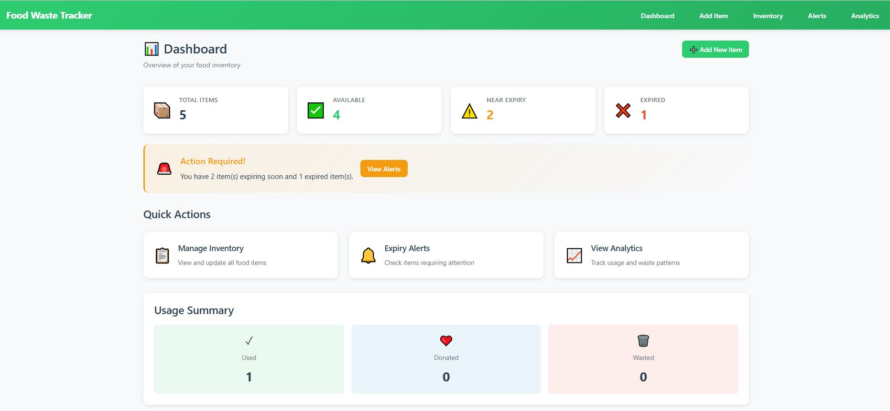
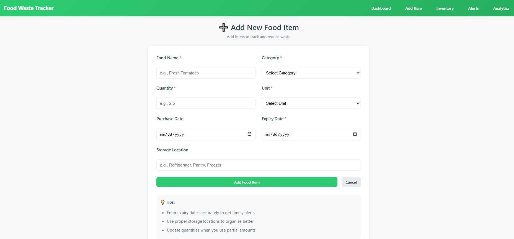
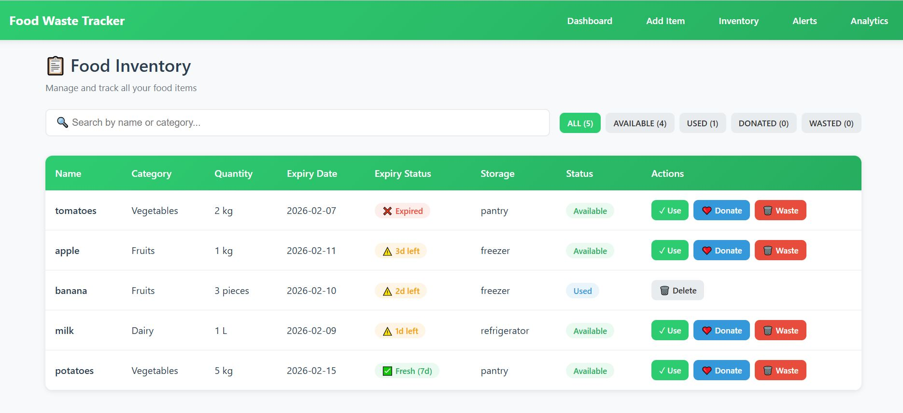
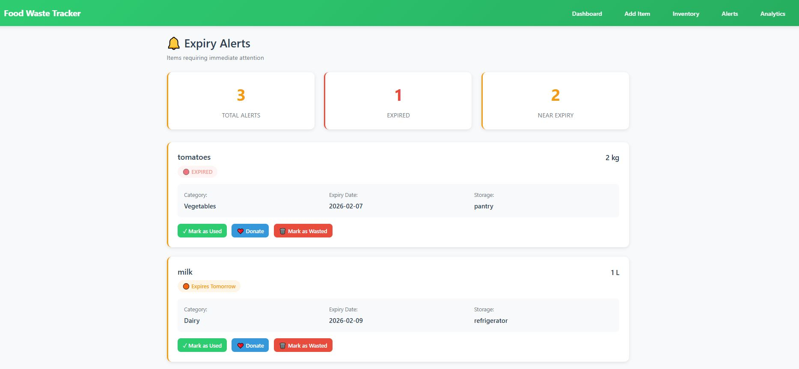
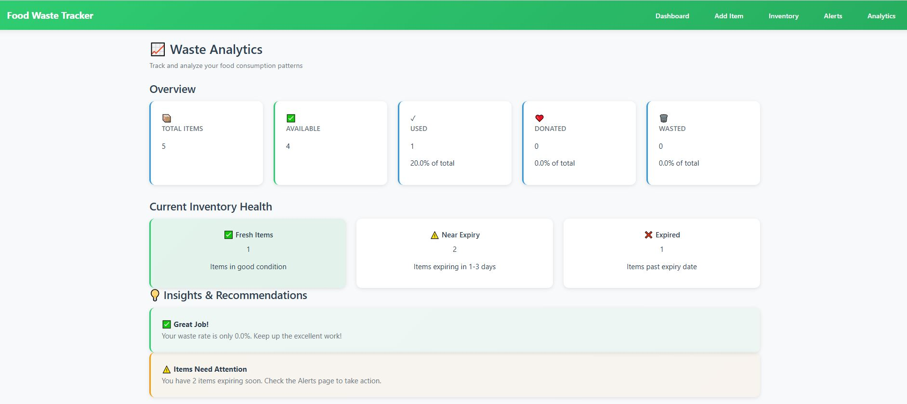

# 🌱 Smart Food Waste Reduction System

A comprehensive full-stack web application designed to track food inventory, monitor expiry dates, reduce food waste, and provide actionable insights. The system helps users and organizations manage food efficiently through real-time tracking, alerts, and analytics.

---

## ✨ Key Features

### **Core Functionality**
- ✅ **Food Inventory Management** - Add, view, and manage food items with details
- ✅ **Expiry Date Tracking** - Automatic expiry state calculation (FRESH, NEAR_EXPIRY, EXPIRED)
- ✅ **Smart Alerts** - Real-time notifications for items nearing expiry
- ✅ **Status Management** - Track food lifecycle: AVAILABLE → USED/DONATED/WASTED
- ✅ **Automatic Logging** - Every status change is logged automatically
- ✅ **Waste Analytics** - Comprehensive insights on food waste patterns
- ✅ **Search & Filter** - Find items by name, category, or status
- ✅ **Responsive Design** - Works seamlessly on desktop and mobile devices

### **Dashboard Features**
- **Dashboard** - Real-time statistics and alert banner
- **Add Item** - User-friendly form with validation
- **Inventory** - Searchable table with action buttons and modal for waste reasons
- **Alerts** - Urgent items sorted by expiry urgency
- **Analytics** - Waste breakdown by category/reason with recommendations

---

## 📸 Screenshots

### Dashboard - Real-time Statistics & Alerts

*View real-time stats, alert banner, quick links, and usage summary*

### Add Item - Food Entry Form

*Easy-to-use form with validation, categories, units, and storage location*

### Inventory - Search & Manage Items

*Searchable table with filters, color-coded badges, and action buttons*

### Alerts - Urgent Items

*Items needing attention with urgency badges and quick actions*

### Analytics - Waste Insights

*Comprehensive breakdown by category, reason, and actionable recommendations*

---

## 🛠️ Tech Stack

### **Backend**
- **Framework**: Flask with Flask-CORS
- **ORM**: SQLAlchemy
- **Database**: SQLite (default for development)
- **Language**: Python 3.8+
- **Key Libraries**: Flask-JWT-Extended, Werkzeug, python-dotenv

### **Frontend**
- **Framework**: React 18 with Vite
- **Routing**: React Router v6
- **HTTP Client**: Axios
- **Styling**: Plain CSS with responsive design
- **Language**: JavaScript (ES6+)

## 📁 Project Structure

```
smart-food-waste-reduction/smart-food-waste/
│
├── backend/                          # Flask REST API
│   ├── main.py                       # Main Flask app with all endpoints
│   ├── models.py                     # SQLAlchemy database models
│   ├── config.py                     # Configuration settings
│   ├── requirements.txt              # Python dependencies
│   └── database.db                   # SQLite database (created on first run)
│
└── frontend/                         # React + Vite SPA
    ├── src/
    │   ├── App.jsx                   # Main app component with routing
    │   ├── App.css                   # Root styling
    │   ├── index.css                 # Global styles
    │   ├── main.jsx                  # Entry point
    │   ├── components/
    │   │   └── Navbar.jsx            # Navigation bar
    │   ├── pages/
    │   │   ├── Dashboard.jsx         # Home dashboard with stats
    │   │   ├── AddItem.jsx           # Food item creation form
    │   │   ├── Inventory.jsx         # Food inventory view with actions
    │   │   ├── Alerts.jsx            # Expiry alerts for urgent items
    │   │   └── Analytics.jsx         # Waste analytics and insights
    │   ├── services/
    │   │   └── foodService.js        # API client service layer
    │   └── styles/
    │       ├── Navbar.css
    │       ├── Dashboard.css
    │       ├── AddItem.css
    │       ├── Inventory.css
    │       ├── Alerts.css
    │       └── Analytics.css
    ├── package.json
    ├── vite.config.js
    ├── index.html
    └── .gitignore
```

## 🚀 Getting Started

### **Prerequisites**
- Python 3.8 or higher
- Node.js 16+ and npm 8+
- Git

### **Backend Setup**

1. **Navigate to backend directory**:
   ```bash
   cd backend
   ```

2. **Create virtual environment (optional but recommended)**:
   ```bash
   python -m venv venv
   # Windows
   venv\Scripts\activate
   # macOS/Linux
   source venv/bin/activate
   ```

3. **Install dependencies**:
   ```bash
   pip install -r requirements.txt
   ```

4. **Start the Flask server**:
   ```bash
   python main.py
   ```
   - Server will run on `http://127.0.0.1:5000`
   - Default user (id=1) is created automatically on first run
   - SQLite database (`database.db`) is created automatically

### **Frontend Setup**

1. **Navigate to frontend directory**:
   ```bash
   cd frontend
   ```

2. **Install dependencies**:
   ```bash
   npm install
   ```

3. **Start development server**:
   ```bash
   npm run dev
   ```
   - App will open at `http://localhost:5173` (or 5174 if 5173 is busy)
   - Hot module replacement enabled for instant code updates

### **Full System Startup (Quick Start)**

**Terminal 1 - Backend**:
```bash
cd backend
pip install -r requirements.txt
python main.py
```

**Terminal 2 - Frontend**:
```bash
cd frontend
npm install
npm run dev
```

Then open `http://localhost:5173` in your browser!

---

## 🔄 Core System Loop

Food Comes In → Food Is Tracked → User Updates Status → Logs Are Created → Analytics Show Insights

---

## 📡 API Endpoints

| Method | Endpoint | Description |
|--------|----------|-------------|
| `POST` | `/api/foods` | Add new food item |
| `GET` | `/api/foods` | Get all food items with expiry info |
| `POST` | `/api/foods/<id>/status` | Update food status |
| `GET` | `/api/analytics` | Get waste analytics |
| `DELETE` | `/api/foods/<id>` | Delete food item |

---

## 🎯 Quick Usage

1. **Add Item** - Click "Add Item" → Fill form → Submit
2. **Inventory** - Search, filter, and manage items with action buttons
3. **Alerts** - View items needing attention (expiring soon)
4. **Analytics** - See waste insights and breakdowns
5. **Dashboard** - Get real-time overview with stats

---

## 🎨 Color Coding

- 🟢 **Green**: Fresh items, success states
- 🟠 **Orange**: Near expiry, warnings
- 🔴 **Red**: Expired, wasted items
- 🟦 **Blue**: Used items
- 🟣 **Purple**: Donated items

---

## 🐛 Troubleshooting

| Issue | Fix |
|-------|-----|
| Backend 401 error | Old JWT routes commented out |
| CORS errors | Flask-CORS installed and enabled |
| Port in use | Kill process or use different port |
| DB locked | Delete `database.db` and restart |
| API unreachable | Check `foodService.js` API_URL |


