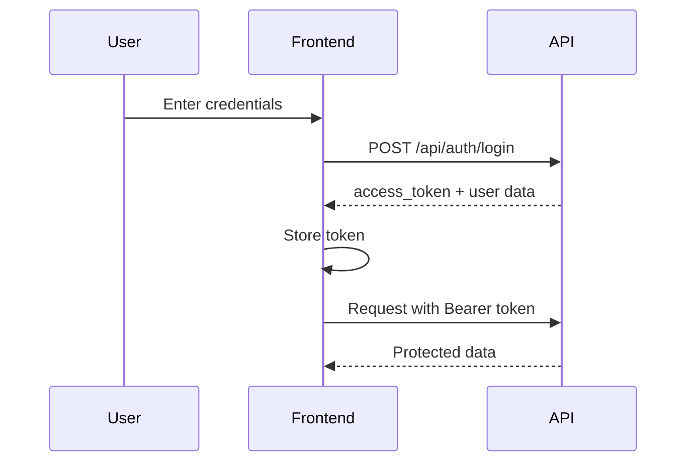

# Food Waste Tracker API Documentation

> **Base URL**: `http://localhost:5000`  
> **Version**: 1.0.0  
> **Last Updated**: February 2026

---

## Table of Contents

1. [Authentication](#authentication)
   - [Register](#1-register-user)
   - [Login](#2-login-user)
2. [User Profile](#user-profile)
   - [Get Profile](#3-get-user-profile)
   - [Update Profile](#4-update-user-profile)
   - [Delete Profile](#5-delete-user-profile)
3. [Categories](#categories)
   - [Create Category](#6-create-category)
   - [List Categories](#7-list-categories)
   - [Delete Category](#8-delete-category)
4. [Food Items](#food-items)
   - [Create Food](#9-create-food-item)
   - [List Food](#10-list-food-items)
   - [Update Food](#11-update-food-item)
   - [Delete Food](#12-delete-food-item)
   - [Change Food Status](#13-change-food-status)
   - [Expiry Alerts](#14-get-expiry-alerts)
5. [Food Logs](#food-logs)
   - [Create Log](#15-create-food-log)
   - [List Logs](#16-list-food-logs)
   - [Get Log by ID](#17-get-food-log-by-id)
   - [Delete Log](#18-delete-food-log)
6. [Analytics](#analytics)
   - [Get Analytics](#19-get-analytics)
7. [Donation Centers](#donation-centers)
   - [Create Center](#20-create-donation-center)
   - [List Centers](#21-list-donation-centers)
   - [Get Center by ID](#22-get-donation-center-by-id)
   - [Update Center](#23-update-donation-center)
   - [Delete Center](#24-delete-donation-center)
8. [Donation Offers](#donation-offers)
   - [Create Offer](#25-create-donation-offer)
   - [List Offers](#26-list-donation-offers)
   - [Get Offer by ID](#27-get-donation-offer-by-id)
   - [Update Offer Status](#28-update-donation-offer-status)
   - [Delete Offer](#29-delete-donation-offer)
9. [Health Check](#health-check)
10. [Frontend Integration Notes](#frontend-integration-notes)

---

## Common Headers

| Header | Value | Required | Description |
|--------|-------|----------|-------------|
| `Content-Type` | `application/json` | Yes | All requests must be JSON |
| `Authorization` | `Bearer <access_token>` | Protected Endpoints | JWT token from login |

---

## Error Response Format

All error responses follow this format:

```json
{
  "error": "Error message describing what went wrong"
}
```

### Common HTTP Status Codes

| Code | Description |
|------|-------------|
| `200` | Success |
| `201` | Created |
| `400` | Bad Request (invalid input) |
| `401` | Unauthorized (invalid credentials) |
| `403` | Forbidden (not allowed to access resource) |
| `404` | Not Found |
| `500` | Internal Server Error |

---

# Authentication

## 1. Register User

Creates a new user account.

| Property | Value |
|----------|-------|
| **Method** | `POST` |
| **URL** | `/api/auth/register` |
| **Auth Required** | ❌ No |

### Request Body

| Parameter | Type | Required | Description |
|-----------|------|----------|-------------|
| `name` | string | ✅ Yes | User's full name |
| `email` | string | ✅ Yes | User's email address (must be unique) |
| `password` | string | ✅ Yes | User's password (will be hashed) |
| `phone` | string | ❌ No | User's phone number |

### Example Request

```json
{
  "name": "John Doe",
  "email": "john@example.com",
  "password": "securePassword123",
  "phone": "+1234567890"
}
```

### Success Response

**Status**: `201 Created`

```json
{
  "message": "User registered successfully"
}
```

### Error Responses

| Status | Condition |
|--------|-----------|
| `400` | JSON body not provided |
| `400` | Missing required fields (name, email, password) |
| `400` | Email already exists |

> [!NOTE]
> **Frontend Note**: After successful registration, redirect the user to the login page. Do not automatically log in.

---

## 2. Login User

Authenticates a user and returns a JWT access token.

| Property | Value |
|----------|-------|
| **Method** | `POST` |
| **URL** | `/api/auth/login` |
| **Auth Required** | ❌ No |

### Request Body

| Parameter | Type | Required | Description |
|-----------|------|----------|-------------|
| `email` | string | ✅ Yes | User's email address |
| `password` | string | ✅ Yes | User's password |

### Example Request

```json
{
  "email": "john@example.com",
  "password": "securePassword123"
}
```

### Success Response

**Status**: `200 OK`

```json
{
  "access_token": "eyJhbGciOiJIUzI1NiIsInR5cCI6IkpXVCJ9...",
  "user": {
    "id": 1,
    "name": "John Doe",
    "email": "john@example.com",
    "phone": "+1234567890"
  }
}
```

### Response Parameters

| Parameter | Type | Description |
|-----------|------|-------------|
| `access_token` | string | JWT token (valid for 1 hour) |
| `user.id` | integer | User's unique ID |
| `user.name` | string | User's full name |
| `user.email` | string | User's email |
| `user.phone` | string | User's phone number (nullable) |

### Error Responses

| Status | Condition |
|--------|-----------|
| `400` | JSON body not provided |
| `401` | Invalid email or password |

> [!IMPORTANT]
> **Frontend Note**: Store the `access_token` securely (e.g., localStorage or httpOnly cookie). Include it in the `Authorization` header for all protected endpoints as `Bearer <token>`. Token expires in **1 hour**.

---

# User Profile

## 3. Get User Profile

Retrieves the currently authenticated user's profile.

| Property | Value |
|----------|-------|
| **Method** | `GET` |
| **URL** | `/api/users/me` |
| **Auth Required** | ✅ Yes |

### Success Response

**Status**: `200 OK`

```json
{
  "id": 1,
  "name": "John Doe",
  "email": "john@example.com",
  "phone": "+1234567890",
  "created_at": "2026-01-15T10:30:00"
}
```

### Response Parameters

| Parameter | Type | Description |
|-----------|------|-------------|
| `id` | integer | User's unique ID |
| `name` | string | User's full name |
| `email` | string | User's email (cannot be changed) |
| `phone` | string | User's phone number (nullable) |
| `created_at` | datetime | Account creation timestamp |

---

## 4. Update User Profile

Updates the currently authenticated user's profile.

| Property | Value |
|----------|-------|
| **Method** | `PUT` |
| **URL** | `/api/users/me` |
| **Auth Required** | ✅ Yes |

### Request Body

| Parameter | Type | Required | Description |
|-----------|------|----------|-------------|
| `name` | string | ❌ No | New name (keeps old if not provided) |
| `phone` | string | ❌ No | New phone (keeps old if not provided) |

### Example Request

```json
{
  "name": "John Smith",
  "phone": "+0987654321"
}
```

### Success Response

**Status**: `200 OK`

```json
{
  "message": "Profile updated successfully"
}
```

> [!NOTE]
> **Frontend Note**: Email cannot be updated via this endpoint. Only `name` and `phone` can be modified.

---

## 5. Delete User Profile

Permanently deletes the currently authenticated user's account.

| Property | Value |
|----------|-------|
| **Method** | `DELETE` |
| **URL** | `/api/users/me` |
| **Auth Required** | ✅ Yes |

### Success Response

**Status**: `200 OK`

```json
{
  "message": "User deleted successfully"
}
```

> [!CAUTION]
> **Frontend Note**: This action is **irreversible**. Show a confirmation dialog before calling this endpoint. After deletion, redirect to login page and clear stored tokens.

---

# Categories

## 6. Create Category

Creates a new food category for the authenticated user.

| Property | Value |
|----------|-------|
| **Method** | `POST` |
| **URL** | `/api/category` |
| **Auth Required** | ✅ Yes |

### Request Body

| Parameter | Type | Required | Description |
|-----------|------|----------|-------------|
| `category` | string | ✅ Yes | Category name |

### Example Request

```json
{
  "category": "Dairy Products"
}
```

### Success Response

**Status**: `201 Created`

```json
{
  "message": "Category Added Successfully"
}
```

---

## 7. List Categories

Returns all categories for the authenticated user.

| Property | Value |
|----------|-------|
| **Method** | `GET` |
| **URL** | `/api/category` |
| **Auth Required** | ✅ Yes |

### Success Response

**Status**: `200 OK`

```json
{
  "category": [
    {
      "id": 1,
      "name": "Dairy Products"
    },
    {
      "id": 2,
      "name": "Vegetables"
    }
  ]
}
```

### Response Parameters

| Parameter | Type | Description |
|-----------|------|-------------|
| `category` | array | List of category objects |
| `category[].id` | integer | Category unique ID |
| `category[].name` | string | Category name |

> [!NOTE]
> **Frontend Note**: Categories are user-specific. Use these IDs when creating food items.

---

## 8. Delete Category

Deletes a specific category by ID.

| Property | Value |
|----------|-------|
| **Method** | `DELETE` |
| **URL** | `/api/category/<id>` |
| **Auth Required** | ✅ Yes |

### Path Parameters

| Parameter | Type | Required | Description |
|-----------|------|----------|-------------|
| `id` | integer | ✅ Yes | Category ID to delete |

### Success Response

**Status**: `200 OK`

```json
{
  "message": "category deleted successfully"
}
```

### Error Responses

| Status | Condition |
|--------|-----------|
| `404` | Category not found |

> [!WARNING]
> **Frontend Note**: Deleting a category may affect food items linked to it. Consider warning users about this.

---

# Food Items

## 9. Create Food Item

Adds a new food item to the user's inventory.

| Property | Value |
|----------|-------|
| **Method** | `POST` |
| **URL** | `/api/food` |
| **Auth Required** | ✅ Yes |

### Request Body

| Parameter | Type | Required | Description |
|-----------|------|----------|-------------|
| `name` | string | ✅ Yes | Food item name |
| `category` | integer | ✅ Yes | Category ID (from categories list) |
| `quantity` | float | ✅ Yes | Quantity amount |
| `unit` | string | ❌ No | Unit of measurement (e.g., "kg", "pcs") |
| `purchase_date` | string | ❌ No | Date purchased (format: `YYYY-MM-DD`) |
| `expiry_date` | string | ❌ No | Expiration date (format: `YYYY-MM-DD`) |

### Example Request

```json
{
  "name": "Milk",
  "category": 1,
  "quantity": 2,
  "unit": "liters",
  "purchase_date": "2026-02-01",
  "expiry_date": "2026-02-10"
}
```

### Success Response

**Status**: `201 Created`

```json
{
  "message": "Succesfully added food items"
}
```

> [!TIP]
> **Frontend Note**: Provide date pickers for `purchase_date` and `expiry_date`. Pre-populate `purchase_date` with today's date.

---

## 10. List Food Items

Returns all food items for the authenticated user, categorized by status.

| Property | Value |
|----------|-------|
| **Method** | `GET` |
| **URL** | `/api/food` |
| **Auth Required** | ✅ Yes |

### Success Response

**Status**: `200 OK`

```json
{
  "available_count": 5,
  "expired_count": 2,
  "available_items": [
    {
      "id": 1,
      "name": "Milk",
      "category": 1,
      "quantity": 2,
      "unit": "liters",
      "expiry_date": "2026-02-10",
      "status": "AVAILABLE",
      "expiry_state": "NEAR_EXPIRY",
      "days_left": 3
    }
  ],
  "expired_items": [
    {
      "id": 2,
      "name": "Bread",
      "category": 2,
      "quantity": 1,
      "unit": "pcs",
      "expiry_date": "2026-01-30",
      "status": "AVAILABLE",
      "expiry_state": "EXPIRED",
      "days_left": -5
    }
  ],
  "used_items": [],
  "donated_items": [],
  "wasted_items": []
}
```

### Response Parameters

| Parameter | Type | Description |
|-----------|------|-------------|
| `available_count` | integer | Number of available (non-expired) items |
| `expired_count` | integer | Number of expired items |
| `available_items` | array | Items that are AVAILABLE and not expired |
| `expired_items` | array | Items that are AVAILABLE but expired |
| `used_items` | array | Items marked as USED |
| `donated_items` | array | Items marked as DONATED |
| `wasted_items` | array | Items marked as WASTED |

### Food Item Object

| Field | Type | Description |
|-------|------|-------------|
| `id` | integer | Food item unique ID |
| `name` | string | Food item name |
| `category` | integer | Category ID |
| `quantity` | float | Current quantity |
| `unit` | string | Unit of measurement |
| `expiry_date` | date | Expiration date |
| `status` | string | Status: `AVAILABLE`, `USED`, `DONATED`, `WASTED` |
| `expiry_state` | string | Expiry state: `FRESH`, `NEAR_EXPIRY`, `EXPIRED`, `null` |
| `days_left` | integer | Days until expiry (negative = already expired) |

### Expiry State Logic

| State | Condition |
|-------|-----------|
| `EXPIRED` | `days_left < 0` |
| `NEAR_EXPIRY` | `1 <= days_left <= 3` |
| `FRESH` | `days_left > 3` |
| `null` | No expiry date set |

> [!IMPORTANT]
> **Frontend Note**: 
> - Items are sorted: `NEAR_EXPIRY` items appear first in available_items
> - Use `expiry_state` to color-code items (red for expired, orange for near expiry, green for fresh)
> - Consider showing badges or warnings for items with low `days_left`

---

## 11. Update Food Item

Updates an existing food item.

| Property | Value |
|----------|-------|
| **Method** | `PUT` |
| **URL** | `/api/food/<id>` |
| **Auth Required** | ✅ Yes |

### Path Parameters

| Parameter | Type | Required | Description |
|-----------|------|----------|-------------|
| `id` | integer | ✅ Yes | Food item ID |

### Request Body

| Parameter | Type | Required | Description |
|-----------|------|----------|-------------|
| `quantity` | float | ❌ No | Updated quantity |
| `expiry_date` | string | ❌ No | Updated expiry date |
| `status` | string | ❌ No | Updated status |
| `wasted_reason` | string | ❌ No | Reason if marking as wasted |

### Example Request

```json
{
  "quantity": 1.5,
  "status": "WASTED",
  "wasted_reason": "Forgot in the fridge"
}
```

### Success Response

**Status**: `200 OK`

```json
{
  "message": "Food item successfully updated"
}
```

---

## 12. Delete Food Item

Permanently deletes a food item.

| Property | Value |
|----------|-------|
| **Method** | `DELETE` |
| **URL** | `/api/food/<id>` |
| **Auth Required** | ✅ Yes |

### Path Parameters

| Parameter | Type | Required | Description |
|-----------|------|----------|-------------|
| `id` | integer | ✅ Yes | Food item ID |

### Success Response

**Status**: `200 OK`

```json
{
  "message": "Food item is successfully deleted"
}
```

---

## 13. Change Food Status

Changes only the status of a food item.

| Property | Value |
|----------|-------|
| **Method** | `PATCH` |
| **URL** | `/api/food/<id>/status` |
| **Auth Required** | ✅ Yes |

### Path Parameters

| Parameter | Type | Required | Description |
|-----------|------|----------|-------------|
| `id` | integer | ✅ Yes | Food item ID |

### Request Body

| Parameter | Type | Required | Description |
|-----------|------|----------|-------------|
| `status` | string | ✅ Yes | New status: `USED`, `DONATED`, `WASTED` |
| `reason` | string | ❌ No | Required if status is `WASTED` |

### Example Request

```json
{
  "status": "WASTED",
  "reason": "Expired before use"
}
```

### Success Response

**Status**: `200 OK`

```json
{
  "message": "Status updated successfully"
}
```

> [!NOTE]
> **Frontend Note**: Prefer using [Create Food Log](#15-create-food-log) instead of this endpoint, as it tracks historical data and supports partial quantities.

---

## 14. Get Expiry Alerts

Returns items that are expired or near expiry.

| Property | Value |
|----------|-------|
| **Method** | `GET` |
| **URL** | `/api/food/alerts` |
| **Auth Required** | ✅ Yes |

### Success Response

**Status**: `200 OK`

```json
{
  "expired_count": 2,
  "near_expiry_count": 3,
  "total_alerts": 5,
  "items": [
    {
      "id": 2,
      "name": "Bread",
      "category": 2,
      "expiry_date": "2026-01-30",
      "expiry_state": "EXPIRED",
      "days_left": -5
    },
    {
      "id": 1,
      "name": "Milk",
      "category": 1,
      "expiry_date": "2026-02-07",
      "expiry_state": "NEAR_EXPIRY",
      "days_left": 3
    }
  ]
}
```

### Response Parameters

| Parameter | Type | Description |
|-----------|------|-------------|
| `expired_count` | integer | Count of expired items |
| `near_expiry_count` | integer | Count of items expiring in 1-3 days |
| `total_alerts` | integer | Total count of alert items |
| `items` | array | List of alert items (sorted by days_left ascending) |

> [!TIP]
> **Frontend Note**: Use this endpoint for notification badges and dashboard alerts. Poll periodically or call on app load to show expiry warnings.

---

# Food Logs

## 15. Create Food Log

Logs an action (USED, DONATED, WASTED) for a food item and updates its quantity.

| Property | Value |
|----------|-------|
| **Method** | `POST` |
| **URL** | `/api/food-logs` |
| **Auth Required** | ✅ Yes |

### Request Body

| Parameter | Type | Required | Description |
|-----------|------|----------|-------------|
| `food_id` | integer | ✅ Yes | ID of the food item |
| `action` | string | ✅ Yes | Action: `USED`, `DONATED`, `WASTED` |
| `quantity` | float | ✅ Yes | Quantity to log (cannot exceed available) |
| `reason` | string | ❌ No | Reason (recommended for WASTED) |
| `remarks` | string | ❌ No | Additional notes |

### Example Request

```json
{
  "food_id": 1,
  "action": "USED",
  "quantity": 0.5,
  "remarks": "Made breakfast"
}
```

### Success Response

**Status**: `201 Created`

```json
{
  "message": "Food log created successfully"
}
```

### Business Logic

- The specified quantity is **subtracted** from the food item's quantity
- If food quantity reaches 0, the food item's status is updated to the action type
- If action is `WASTED` and quantity reaches 0, `reason_of_waste` is set on the food item

### Error Responses

| Status | Condition |
|--------|-----------|
| `400` | Missing required fields |
| `400` | Invalid action type |
| `400` | Quantity exceeds available food quantity |
| `403` | Food item belongs to another user |
| `404` | Food item not found |

> [!IMPORTANT]
> **Frontend Note**: This is the **recommended way** to track food consumption/disposal. It creates a historical log and properly updates food quantities. Show a quantity input that cannot exceed the current food quantity.

---

## 16. List Food Logs

Returns all food logs for the authenticated user.

| Property | Value |
|----------|-------|
| **Method** | `GET` |
| **URL** | `/api/food-logs` |
| **Auth Required** | ✅ Yes |

### Query Parameters

| Parameter | Type | Required | Description |
|-----------|------|----------|-------------|
| `action` | string | ❌ No | Filter by action: `USED`, `DONATED`, `WASTED` |
| `food_id` | integer | ❌ No | Filter by specific food item |

### Example Requests

```
GET /api/food-logs
GET /api/food-logs?action=DONATED
GET /api/food-logs?food_id=5
GET /api/food-logs?action=WASTED&food_id=5
```

### Success Response

**Status**: `200 OK`

```json
{
  "food_logs": [
    {
      "id": 1,
      "food_id": 1,
      "food_name": "Milk",
      "action": "USED",
      "quantity": 0.5,
      "action_date": "2026-02-04",
      "reason": null,
      "remarks": "Made breakfast"
    }
  ],
  "total_count": 1
}
```

### Response Parameters

| Parameter | Type | Description |
|-----------|------|-------------|
| `food_logs` | array | List of log entries |
| `total_count` | integer | Total number of logs returned |
| `food_logs[].id` | integer | Log entry ID |
| `food_logs[].food_id` | integer | Related food item ID |
| `food_logs[].food_name` | string | Food item name (null if deleted) |
| `food_logs[].action` | string | Action performed |
| `food_logs[].quantity` | float | Quantity involved |
| `food_logs[].action_date` | date | When the action occurred |
| `food_logs[].reason` | string | Reason provided |
| `food_logs[].remarks` | string | Additional remarks |

---

## 17. Get Food Log by ID

Returns a specific food log entry.

| Property | Value |
|----------|-------|
| **Method** | `GET` |
| **URL** | `/api/food-logs/<id>` |
| **Auth Required** | ✅ Yes |

### Path Parameters

| Parameter | Type | Required | Description |
|-----------|------|----------|-------------|
| `id` | integer | ✅ Yes | Log entry ID |

### Success Response

**Status**: `200 OK`

```json
{
  "id": 1,
  "food_id": 1,
  "food_name": "Milk",
  "action": "USED",
  "quantity": 0.5,
  "action_date": "2026-02-04",
  "reason": null,
  "remarks": "Made breakfast"
}
```

### Error Responses

| Status | Condition |
|--------|-----------|
| `403` | Log belongs to another user |
| `404` | Log not found |

---

## 18. Delete Food Log

Deletes a food log entry.

| Property | Value |
|----------|-------|
| **Method** | `DELETE` |
| **URL** | `/api/food-logs/<id>` |
| **Auth Required** | ✅ Yes |

### Path Parameters

| Parameter | Type | Required | Description |
|-----------|------|----------|-------------|
| `id` | integer | ✅ Yes | Log entry ID |

### Success Response

**Status**: `200 OK`

```json
{
  "message": "Food log deleted successfully"
}
```

> [!WARNING]
> **Frontend Note**: Deleting a log does **NOT** restore the food quantity. This only removes the historical record.

---

# Analytics

## 19. Get Analytics

Returns usage statistics for the authenticated user.

| Property | Value |
|----------|-------|
| **Method** | `GET` |
| **URL** | `/api/analytics` |
| **Auth Required** | ✅ Yes |

### Query Parameters

| Parameter | Type | Required | Default | Description |
|-----------|------|----------|---------|-------------|
| `period` | string | ❌ No | `overall` | Time period: `today`, `7days`, `30days`, `overall` |

### Example Requests

```
GET /api/analytics
GET /api/analytics?period=today
GET /api/analytics?period=7days
GET /api/analytics?period=30days
```

### Success Response

**Status**: `200 OK`

```json
{
  "period": "7days",
  "start_date": "2026-01-28",
  "analytics": {
    "USED": {
      "count": 15,
      "total_quantity": 25.5
    },
    "DONATED": {
      "count": 3,
      "total_quantity": 8.0
    },
    "WASTED": {
      "count": 2,
      "total_quantity": 3.5
    }
  },
  "total_logged_items": 20,
  "total_quantity_processed": 37.0
}
```

### Response Parameters

| Parameter | Type | Description |
|-----------|------|-------------|
| `period` | string | The requested time period |
| `start_date` | string | Start date for filtering (null for overall) |
| `analytics.USED.count` | integer | Number of USED log entries |
| `analytics.USED.total_quantity` | float | Total quantity used |
| `analytics.DONATED.count` | integer | Number of DONATED log entries |
| `analytics.DONATED.total_quantity` | float | Total quantity donated |
| `analytics.WASTED.count` | integer | Number of WASTED log entries |
| `analytics.WASTED.total_quantity` | float | Total quantity wasted |
| `total_logged_items` | integer | Sum of all counts |
| `total_quantity_processed` | float | Sum of all quantities |

> [!TIP]
> **Frontend Note**: Use this data for dashboard charts and statistics. Display a pie chart for action distribution and a summary of waste vs. usage rates.

---

# Donation Centers

## 20. Create Donation Center

Creates a new donation center.

| Property | Value |
|----------|-------|
| **Method** | `POST` |
| **URL** | `/api/donation-centers` |
| **Auth Required** | ✅ Yes |

### Request Body

| Parameter | Type | Required | Description |
|-----------|------|----------|-------------|
| `name` | string | ✅ Yes | Center name |
| `city` | string | ❌ No | City location |
| `address` | string | ❌ No | Full address |
| `phone` | string | ❌ No | Contact phone |
| `email` | string | ❌ No | Contact email |
| `accepts_items` | string | ❌ No | Types of items accepted (e.g., "cooked,dry,dairy") |
| `open_hours` | string | ❌ No | Operating hours (e.g., "9 AM - 5 PM") |

### Example Request

```json
{
  "name": "Community Food Bank",
  "city": "New York",
  "address": "123 Main Street",
  "phone": "+1234567890",
  "email": "contact@foodbank.org",
  "accepts_items": "dry,canned,fresh",
  "open_hours": "Mon-Fri 9AM-5PM"
}
```

### Success Response

**Status**: `201 Created`

```json
{
  "message": "Donation center created successfully",
  "id": 1
}
```

---

## 21. List Donation Centers

Returns all donation centers.

| Property | Value |
|----------|-------|
| **Method** | `GET` |
| **URL** | `/api/donation-centers` |
| **Auth Required** | ❌ No |

### Query Parameters

| Parameter | Type | Required | Description |
|-----------|------|----------|-------------|
| `city` | string | ❌ No | Filter by city (case-insensitive, partial match) |

### Example Requests

```
GET /api/donation-centers
GET /api/donation-centers?city=New York
```

### Success Response

**Status**: `200 OK`

```json
{
  "donation_centers": [
    {
      "id": 1,
      "name": "Community Food Bank",
      "city": "New York",
      "address": "123 Main Street",
      "phone": "+1234567890",
      "email": "contact@foodbank.org",
      "accepts_items": "dry,canned,fresh",
      "open_hours": "Mon-Fri 9AM-5PM"
    }
  ],
  "total_count": 1
}
```

> [!NOTE]
> **Frontend Note**: This endpoint is **public** (no auth required). Display a searchable list of donation centers with location filtering.

---

## 22. Get Donation Center by ID

Returns a specific donation center.

| Property | Value |
|----------|-------|
| **Method** | `GET` |
| **URL** | `/api/donation-centers/<id>` |
| **Auth Required** | ❌ No |

### Path Parameters

| Parameter | Type | Required | Description |
|-----------|------|----------|-------------|
| `id` | integer | ✅ Yes | Donation center ID |

### Success Response

**Status**: `200 OK`

```json
{
  "id": 1,
  "name": "Community Food Bank",
  "city": "New York",
  "address": "123 Main Street",
  "phone": "+1234567890",
  "email": "contact@foodbank.org",
  "accepts_items": "dry,canned,fresh",
  "open_hours": "Mon-Fri 9AM-5PM",
  "created_at": "2026-01-15T10:30:00"
}
```

---

## 23. Update Donation Center

Updates a donation center.

| Property | Value |
|----------|-------|
| **Method** | `PUT` |
| **URL** | `/api/donation-centers/<id>` |
| **Auth Required** | ✅ Yes |

### Path Parameters

| Parameter | Type | Required | Description |
|-----------|------|----------|-------------|
| `id` | integer | ✅ Yes | Donation center ID |

### Request Body

All fields are optional. Only provided fields will be updated.

| Parameter | Type | Description |
|-----------|------|-------------|
| `name` | string | Center name |
| `city` | string | City location |
| `address` | string | Full address |
| `phone` | string | Contact phone |
| `email` | string | Contact email |
| `accepts_items` | string | Types of items accepted |
| `open_hours` | string | Operating hours |

### Success Response

**Status**: `200 OK`

```json
{
  "message": "Donation center updated successfully"
}
```

---

## 24. Delete Donation Center

Deletes a donation center.

| Property | Value |
|----------|-------|
| **Method** | `DELETE` |
| **URL** | `/api/donation-centers/<id>` |
| **Auth Required** | ✅ Yes |

### Path Parameters

| Parameter | Type | Required | Description |
|-----------|------|----------|-------------|
| `id` | integer | ✅ Yes | Donation center ID |

### Success Response

**Status**: `200 OK`

```json
{
  "message": "Donation center deleted successfully"
}
```

---

# Donation Offers

## 25. Create Donation Offer

Creates a new donation offer with multiple food items.

| Property | Value |
|----------|-------|
| **Method** | `POST` |
| **URL** | `/api/donation-offers` |
| **Auth Required** | ✅ Yes |

### Request Body

| Parameter | Type | Required | Description |
|-----------|------|----------|-------------|
| `donation_center_id` | integer | ❌ No | Target donation center (optional) |
| `items` | array | ✅ Yes | Array of items to donate |
| `items[].food_id` | integer | ✅ Yes | Food item ID |
| `items[].quantity` | float | ✅ Yes | Quantity to donate |
| `remarks` | string | ❌ No | Additional notes |

### Example Request

```json
{
  "donation_center_id": 1,
  "items": [
    {
      "food_id": 1,
      "quantity": 2
    },
    {
      "food_id": 3,
      "quantity": 5
    }
  ],
  "remarks": "Please pick up before 5 PM"
}
```

### Success Response

**Status**: `201 Created`

```json
{
  "message": "Donation offer created successfully",
  "id": 1
}
```

### Error Responses

| Status | Condition |
|--------|-----------|
| `400` | No items provided |
| `400` | Item missing food_id or quantity |
| `400` | Quantity exceeds available for food item |
| `403` | Unauthorized access to food item |
| `404` | Donation center not found |
| `404` | Food item not found |

> [!IMPORTANT]
> **Frontend Note**: 
> - Food quantities are **NOT** deducted when creating an offer
> - Quantities are only deducted when the offer status changes to `PICKED_UP`
> - Allow users to select multiple food items and specify quantities for each

---

## 26. List Donation Offers

Returns all donation offers for the authenticated user.

| Property | Value |
|----------|-------|
| **Method** | `GET` |
| **URL** | `/api/donation-offers` |
| **Auth Required** | ✅ Yes |

### Query Parameters

| Parameter | Type | Required | Description |
|-----------|------|----------|-------------|
| `status` | string | ❌ No | Filter by status: `PENDING`, `ACCEPTED`, `REJECTED`, `PICKED_UP`, `CANCELLED` |

### Example Requests

```
GET /api/donation-offers
GET /api/donation-offers?status=PENDING
```

### Success Response

**Status**: `200 OK`

```json
{
  "donation_offers": [
    {
      "id": 1,
      "donation_center_id": 1,
      "donation_center_name": "Community Food Bank",
      "status": "PENDING",
      "remarks": "Please pick up before 5 PM",
      "created_at": "2026-02-04T10:30:00",
      "items": [
        {
          "id": 1,
          "food_id": 1,
          "food_name": "Milk",
          "quantity": 2
        }
      ],
      "item_count": 1
    }
  ],
  "total_count": 1
}
```

### Offer Status Values

| Status | Description |
|--------|-------------|
| `PENDING` | Offer created, awaiting acceptance |
| `ACCEPTED` | Center accepted the offer |
| `REJECTED` | Center rejected the offer |
| `PICKED_UP` | Items have been picked up |
| `CANCELLED` | User cancelled the offer |

---

## 27. Get Donation Offer by ID

Returns a specific donation offer.

| Property | Value |
|----------|-------|
| **Method** | `GET` |
| **URL** | `/api/donation-offers/<id>` |
| **Auth Required** | ✅ Yes |

### Path Parameters

| Parameter | Type | Required | Description |
|-----------|------|----------|-------------|
| `id` | integer | ✅ Yes | Donation offer ID |

### Success Response

**Status**: `200 OK`

```json
{
  "id": 1,
  "donation_center_id": 1,
  "donation_center_name": "Community Food Bank",
  "status": "PENDING",
  "remarks": "Please pick up before 5 PM",
  "created_at": "2026-02-04T10:30:00",
  "items": [
    {
      "id": 1,
      "food_id": 1,
      "food_name": "Milk",
      "quantity": 2
    }
  ]
}
```

---

## 28. Update Donation Offer Status

Updates the status of a donation offer.

| Property | Value |
|----------|-------|
| **Method** | `PATCH` |
| **URL** | `/api/donation-offers/<id>/status` |
| **Auth Required** | ✅ Yes |

### Path Parameters

| Parameter | Type | Required | Description |
|-----------|------|----------|-------------|
| `id` | integer | ✅ Yes | Donation offer ID |

### Request Body

| Parameter | Type | Required | Description |
|-----------|------|----------|-------------|
| `status` | string | ✅ Yes | New status value |

### Valid Status Values

| Status | Description |
|--------|-------------|
| `PENDING` | Reset to pending |
| `ACCEPTED` | Mark as accepted |
| `REJECTED` | Mark as rejected |
| `PICKED_UP` | Mark as picked up (triggers quantity deduction) |
| `CANCELLED` | Cancel the offer |

### Example Request

```json
{
  "status": "PICKED_UP"
}
```

### Success Response

**Status**: `200 OK`

```json
{
  "message": "Donation offer status updated to PICKED_UP"
}
```

### Business Logic for PICKED_UP

When status changes to `PICKED_UP`:
1. Each food item's quantity is reduced by the donated amount
2. If food quantity reaches 0, status is set to `DONATED`
3. A food log entry is created for each item with action `DONATED`

> [!CAUTION]
> **Frontend Note**: The `PICKED_UP` status triggers **irreversible** changes (quantity deduction, status change, log creation). Show a confirmation dialog before allowing this status change.

---

## 29. Delete Donation Offer

Deletes a donation offer.

| Property | Value |
|----------|-------|
| **Method** | `DELETE` |
| **URL** | `/api/donation-offers/<id>` |
| **Auth Required** | ✅ Yes |

### Path Parameters

| Parameter | Type | Required | Description |
|-----------|------|----------|-------------|
| `id` | integer | ✅ Yes | Donation offer ID |

### Success Response

**Status**: `200 OK`

```json
{
  "message": "Donation offer deleted successfully"
}
```

### Error Responses

| Status | Condition |
|--------|-----------|
| `400` | Cannot delete a picked up donation offer |
| `403` | Unauthorized access to donation offer |

> [!WARNING]
> **Frontend Note**: Offers with `PICKED_UP` status cannot be deleted. Hide the delete button for such offers.

---

# Health Check

## 30. Health Check

Simple endpoint to verify the API is running.

| Property | Value |
|----------|-------|
| **Method** | `GET` |
| **URL** | `/api/health` |
| **Auth Required** | ❌ No |

### Success Response

**Status**: `200 OK`

```json
{
  "status": "OK"
}
```

> [!TIP]
> **Frontend Note**: Use this endpoint for connection testing and health monitoring.

---

# Frontend Integration Notes

## Authentication Flow



## Token Management

1. **Storage**: Store the JWT token in `localStorage` or a secure httpOnly cookie
2. **Expiration**: Token expires in **1 hour** (3600 seconds)
3. **Renewal**: Implement token refresh logic or re-login when token expires
4. **Header Format**: `Authorization: Bearer <access_token>`

## Example API Client Setup (JavaScript)

```javascript
const API_BASE = 'http://localhost:5000';

class ApiClient {
  constructor() {
    this.token = localStorage.getItem('access_token');
  }

  setToken(token) {
    this.token = token;
    localStorage.setItem('access_token', token);
  }

  clearToken() {
    this.token = null;
    localStorage.removeItem('access_token');
  }

  async request(endpoint, options = {}) {
    const headers = {
      'Content-Type': 'application/json',
      ...options.headers,
    };

    if (this.token) {
      headers['Authorization'] = `Bearer ${this.token}`;
    }

    const response = await fetch(`${API_BASE}${endpoint}`, {
      ...options,
      headers,
    });

    if (response.status === 401) {
      this.clearToken();
      window.location.href = '/login';
      return;
    }

    return response.json();
  }

  // Auth
  async login(email, password) {
    const data = await this.request('/api/auth/login', {
      method: 'POST',
      body: JSON.stringify({ email, password }),
    });
    if (data.access_token) {
      this.setToken(data.access_token);
    }
    return data;
  }

  async register(name, email, password, phone) {
    return this.request('/api/auth/register', {
      method: 'POST',
      body: JSON.stringify({ name, email, password, phone }),
    });
  }

  // Food
  async getFoodItems() {
    return this.request('/api/food');
  }

  async createFoodItem(data) {
    return this.request('/api/food', {
      method: 'POST',
      body: JSON.stringify(data),
    });
  }

  async createFoodLog(foodId, action, quantity, reason, remarks) {
    return this.request('/api/food-logs', {
      method: 'POST',
      body: JSON.stringify({ food_id: foodId, action, quantity, reason, remarks }),
    });
  }

  // Analytics
  async getAnalytics(period = 'overall') {
    return this.request(`/api/analytics?period=${period}`);
  }
}

export const api = new ApiClient();
```

## Error Handling Best Practices

```javascript
async function handleApiCall(apiCall) {
  try {
    const response = await apiCall();
    
    if (response.error) {
      showToast(response.error, 'error');
      return null;
    }
    
    return response;
  } catch (error) {
    showToast('Network error. Please try again.', 'error');
    return null;
  }
}

// Usage
const result = await handleApiCall(() => api.getFoodItems());
if (result) {
  displayFoodItems(result);
}
```

## UI Recommendations

| Feature | Recommendation |
|---------|----------------|
| Food Items | Color-code by `expiry_state`: 🔴 EXPIRED, 🟠 NEAR_EXPIRY, 🟢 FRESH |
| Dashboard | Show `expired_count` and `near_expiry_count` as notification badges |
| Analytics | Use pie charts for USED/DONATED/WASTED ratio |
| Donation Offers | Disable delete for PICKED_UP status |
| Forms | Pre-fill `purchase_date` with today's date |
| Quantities | Validate against available quantity before submission |

## Date Handling

All dates use the format `YYYY-MM-DD` (ISO 8601).

```javascript
// Convert to API format
const toApiDate = (date) => date.toISOString().split('T')[0];

// Example
const expiryDate = toApiDate(new Date(2026, 1, 15)); // "2026-02-15"
```

---

## Quick Reference: All Endpoints

| Method | Endpoint | Auth | Description |
|--------|----------|------|-------------|
| `POST` | `/api/auth/register` | ❌ | Register new user |
| `POST` | `/api/auth/login` | ❌ | Login user |
| `GET` | `/api/users/me` | ✅ | Get user profile |
| `PUT` | `/api/users/me` | ✅ | Update user profile |
| `DELETE` | `/api/users/me` | ✅ | Delete user account |
| `POST` | `/api/category` | ✅ | Create category |
| `GET` | `/api/category` | ✅ | List categories |
| `DELETE` | `/api/category/<id>` | ✅ | Delete category |
| `POST` | `/api/food` | ✅ | Create food item |
| `GET` | `/api/food` | ✅ | List food items |
| `PUT` | `/api/food/<id>` | ✅ | Update food item |
| `DELETE` | `/api/food/<id>` | ✅ | Delete food item |
| `PATCH` | `/api/food/<id>/status` | ✅ | Change food status |
| `GET` | `/api/food/alerts` | ✅ | Get expiry alerts |
| `POST` | `/api/food-logs` | ✅ | Create food log |
| `GET` | `/api/food-logs` | ✅ | List food logs |
| `GET` | `/api/food-logs/<id>` | ✅ | Get food log by ID |
| `DELETE` | `/api/food-logs/<id>` | ✅ | Delete food log |
| `GET` | `/api/analytics` | ✅ | Get analytics |
| `POST` | `/api/donation-centers` | ✅ | Create donation center |
| `GET` | `/api/donation-centers` | ❌ | List donation centers |
| `GET` | `/api/donation-centers/<id>` | ❌ | Get donation center |
| `PUT` | `/api/donation-centers/<id>` | ✅ | Update donation center |
| `DELETE` | `/api/donation-centers/<id>` | ✅ | Delete donation center |
| `POST` | `/api/donation-offers` | ✅ | Create donation offer |
| `GET` | `/api/donation-offers` | ✅ | List donation offers |
| `GET` | `/api/donation-offers/<id>` | ✅ | Get donation offer |
| `PATCH` | `/api/donation-offers/<id>/status` | ✅ | Update offer status |
| `DELETE` | `/api/donation-offers/<id>` | ✅ | Delete donation offer |
| `GET` | `/api/health` | ❌ | Health check |
